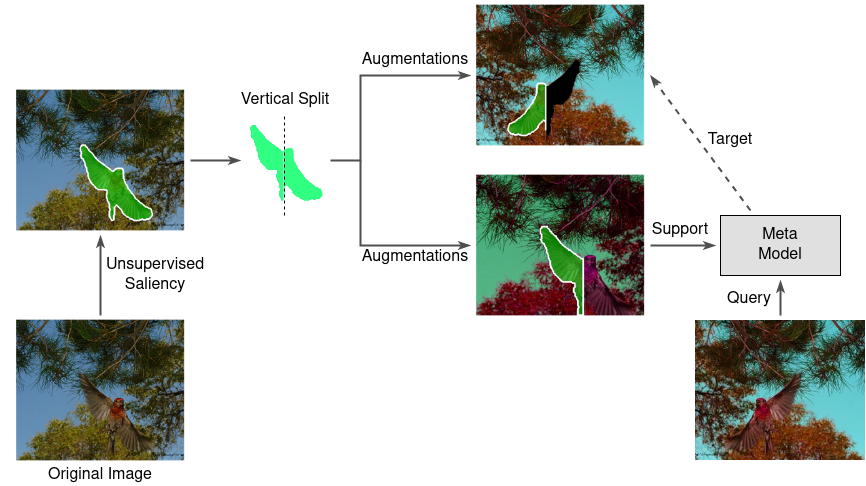

# MaskSplit: Self-supervised Meta-learning for Few-shot Semantic Segmentation
This is the code for our paper "MaskSplit: Self-supervised Meta-learning for Few-shot Semantic Segmentation", which is accepted to WACV 2022 and is available at [[arXiv](https://arxiv.org/abs/2110.12207)].
<p align="middle">
    
</p>

## Requirements

- Python==3.8
- PyTorch==1.8.1
- numpy==1.20.1
- pytorch-lightning==1.2.10
- albumentations==0.5.2
- pyyaml==5.3.1

## Preparing Data
Create the following directory structure before running the code:
```
data
├── coco
│   ├── train2014
│   ├── train2014gt
│   ├── train2014saliency
│   ├── val2014
│   └── val2014gt
└── pascal
    ├── JPEGImages
    ├── SegmentationClassAug
    └── saliency_unsupervised_model
```
> #### 1. PASCAL-5<sup>i</sup>
> Download PASCAL VOC2012 devkit (train/val data):
> ```bash
> wget http://host.robots.ox.ac.uk/pascal/VOC/voc2012/VOCtrainval_11-May-2012.tar
> ```
> SegmentationClassAug and saliency_unsupervised_model can both be downloaded from the following links we provided:[[SegmentationClassAug](https://drive.google.com/file/d/1f5P64u5B2Wr0-ZnhYyOH7rq_nj84JI7o/view?usp=sharing)] and [[saliency_unsupervised_model](https://drive.google.com/file/d/13bINQSYqtwrSlp1KinJU4OxJH3A9-1vj/view?usp=sharing)].

> #### 2. COCO-20<sup>i</sup>
> Download COCO2014 train/val images: 
> ```bash
> wget http://images.cocodataset.org/zips/train2014.zip
> wget http://images.cocodataset.org/zips/val2014.zip
> ```
> COCO2014 train/val annotations and train2014saliency can be downloaded from the following links: [[train2014gt.zip](https://drive.google.com/file/d/1VppmQalF8yEhJ41mV7pgpgsGpBrS34qu/view?usp=sharing)], [[val2014gt.zip](https://drive.google.com/file/d/1I_ccbuMoxXD1XsNEYSpzqJwupxXOTPxC/view?usp=sharing)], [[train2014saliency.zip](https://drive.google.com/file/d/1w-Cdlyyzix1a3Vo4eCqBI4B__RknK5sf/view?usp=sharing)].

## Pre-trained Models
### Pre-trained Backbones
To be able to train the models, pretrained backbones are needed, which can be downloaded from: https://drive.google.com/file/d/1iuMAo5cJ27oBdyDkUI0JyGIEH60Ln2zm/view?usp=sharing.
### Pre-trained Models
We also provide pretrained models, which are trained with our approach. These can be found at [[PASCAL-5<sup>i</sup>](https://drive.google.com/drive/folders/17OFcRNs1cw5E1Ay2V3TfnOQSMA79EwuO?usp=sharing)].
## Training
Before starting training there are some steps that should to be taken:
- Assign model_path variable to the path of the pre-trained backbone in the resnet101 function, which is located inside the file src/model/resnet.py.
- In the config file, enter the path that points the folder that contains the data for the experiment. For PASCAL-5<sup>i</sup>, data_root should be .../data/pascal.

Then, to start training run the command:
 ```bash
 python src/train.py --config {path_to_config_file}
 ```
 
 ## Testing
 To test a model, you need to first do:
- In the config file, enter the path that points the folder that contains the data for the experiment. For PASCAL-5<sup>i</sup>, data_root should be .../data/pascal.
-  In the config file, write the path to the checkpoint of the model.
- (Optional) To do some visualization, change the visualize variable in the config file to be True.

Then, to start testing run the command:
```bash
 python src/test.py --config {path_to_config_file}
 ```

## Acknowledgments

We are grateful to the authors of https://github.com/mboudiaf/RePRI-for-Few-Shot-Segmentation from which some parts of our code are inspired.
